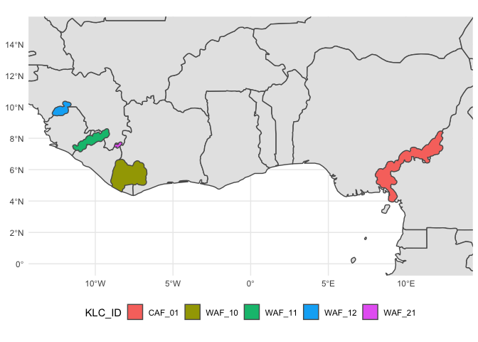
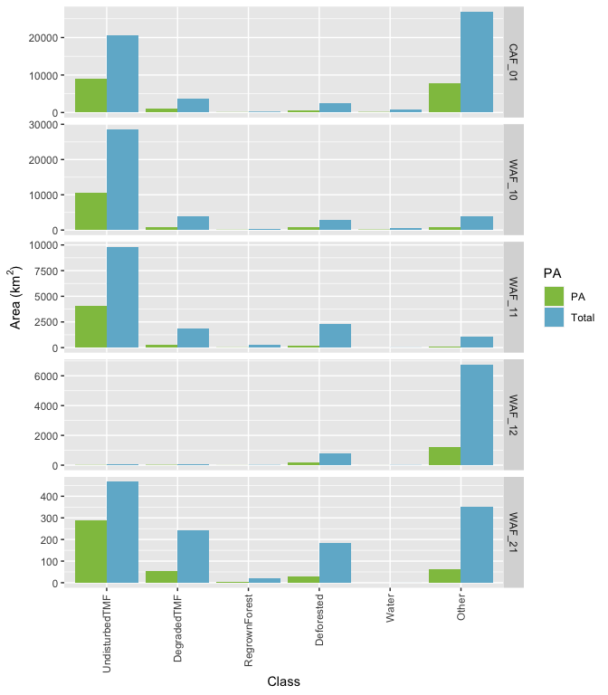
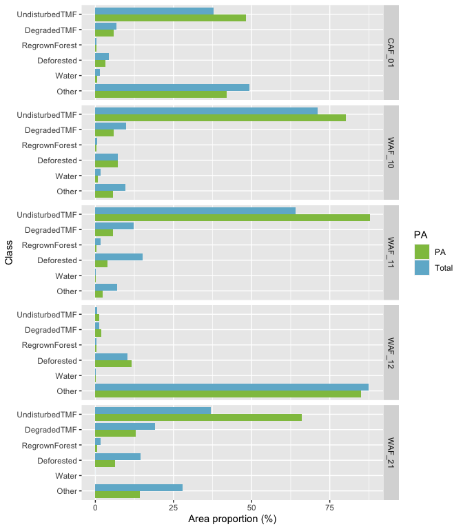
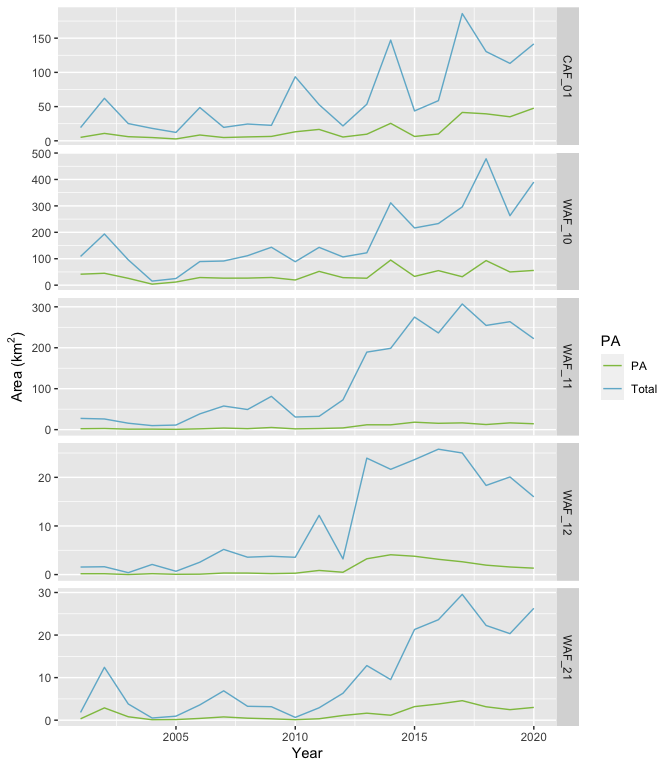
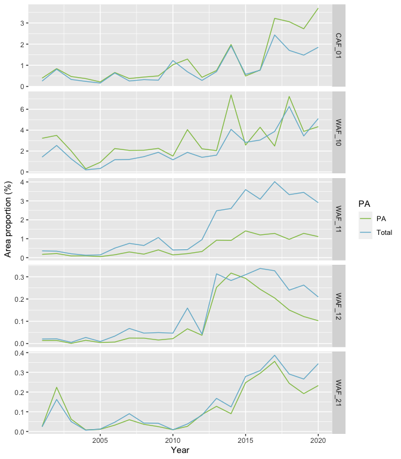

# Context

PAPfor is an EU funded programme that aims at supporting the sustainable management of transboundary tropical moist forest landscapes in west Africa. Its objective is to reduce conflicts between protected areas management services and local populations who often perceive these areas as an obstacle to economic activities.

Objectives:

- Restore ecosystems functions and maintain water resources

- Reduce illegal wildlife trade and dimanstle organised crime

- Support private (re)foretstaion initiatives

- Reinforce regional cooperation and contribute to the "Plan de convergence pour la gestion et l'utilisation des écosystèmes forestiers en Afrique de l'Ouest"

- Contribute to climate change objectives pledged by countries in the Paris Agreement.

The key landscapes identified by the programme are:

- Tai (Côte d'Ivoire) and Grebo-Krahn-Sapo (Liberia)

- Mount Nimba (Côte d'Ivoire and Liberia)

- Gola-Loga-Foya (Liberia and Sierra Leone)

- Mano-Wolingi-Wonegizi-Ziane (Sierra Leone and Guinea)

- Cross River (Nigeria)

- Outamba-Kilimi-Kuru Hills-Pinselli-Soya (Sierra Leone)

Table \@ref(tab:tblklc) give the acronyms of the landscapes as reported in the EU report Larger than Elephants [@LtE].

Table: (\#tab:tblklc)Key landscapes

|KLC_ID |KLC_name                                    |  Area_km2|
|:------|:-------------------------------------------|---------:|
|WAF_21 |Mount Nimba                                 |  1265.402|
|WAF_12 |Outamba-Kilimi                              |  7739.684|
|WAF_10 |Tai-Sapo                                    | 40219.104|
|WAF_11 |Gola-Lofa-Foya-Mano-Wologizi-Wonegizi-Ziama | 15351.532|
|CAF_01 |Cross River-Takamanda-Mt Cameroon-Korup     | 54584.219|

Figure \@ref(fig:mapklc) presents the landscaapes on a map, with their boundaries as revised in 2020 [@klc2020].

(\#fig:mapklc)Map of PAPfor landscapes

# Tropical moist forest

The status of the tropical moist forest at the end of 2019 is available through the EC JRC product tracking long-term (1990-2019) deforestation and degradation in tropical moist forests (TMF_2019_v1) by @Vancutsem21.

The last year of analysis in the product corresponds with the start of the PAPfor programme and could serve as reference for the initial state.

The product is available on Google Earth Engine, where coverage statistics can be calculated. The results of the analysis for the five PAPfor landscapes are given at table\@ref(tab:tbltmf).

Figure \@ref(fig:figtmf) shows the distribution of the TMF product classes in the PAPfor landscapes and inside their protected areas.

(\#fig:figtmf)Tropical moist forest coverage in PAPfor landscapes

Figure \@ref(fig:figtmfpc) shows the distibution of classes in relative terms.

(\#fig:figtmfpc)Proportion of tropical moist forest coverage in PAPfor landscapes and their protected areas.

# Forest loss

The analysis of version 1.8 of the tree cover loss data [@Hansen-gfc] gives a snapshot of the deforestation trend before and during the project.

Figure \@ref(fig:figgfc) shows the trend of forest loss in the PAPfor landscapes and inside their protected areas.

(\#fig:figgfc)Area of forest loss in PAPfor landscapes between 2000 and 2020.

Figure \@ref(fig:figgfcpc) shows the trend of forest loss in the PAPfor landscapes as a percentage of the total area and inside their protected areas as a percentage of the total area under protection.

(\#fig:figgfcpc)Proportion of area deforested every year in PAPfor landscapes between 2000 and 2020.

# Method
The coverage statistics were calculated in Google Earth Engine. The JavaScript code is available at [https://code.earthengine.google.com/d551f2c73e2bbbe0e6d15a88d6e902e3?noload=true](https://code.earthengine.google.com/d551f2c73e2bbbe0e6d15a88d6e902e3?noload=true).

The figures were drawn in R version 4.0.3 (2020-10-10) @R-base with packages dplyr [@dplyr] and ggplot2 [@ggplot2].

# Appendix
## TMF data
Areas are in km^2^

|KLC_ID | UndisturbedTMF| DegradedTMF| RegrownForest| Deforested|       Water|      Other|
|:------|--------------:|-----------:|-------------:|----------:|-----------:|----------:|
|WAF_21 |      466.48819|   242.59399|      21.33398|   182.9214|   0.2622748|   351.7974|
|WAF_12 |       44.26376|    89.26999|      20.52812|   799.4115|  14.7759406|  6771.4210|
|WAF_10 |    28605.48630|  3982.43328|     206.53799|  2864.2592| 652.6473535|  3907.7172|
|CAF_01 |    20601.22181|  3704.37715|     178.49376|  2377.6171| 820.1639740| 26902.3010|
|WAF_11 |     9824.11862|  1886.03770|     248.44319|  2306.9801|  12.5970102|  1073.3240|

## GFC data
Areas are in km^2^

| Year|PA    |     WAF_21|     WAF_12|     WAF_10|     CAF_01|      WAF_11|
|----:|:-----|----------:|----------:|----------:|----------:|-----------:|
| 2001|Total |  1.8169507|  1.5512583| 108.643431|  19.357144|  27.4419114|
| 2001|PA    |  0.3189742|  0.1761500|  41.474600|   5.066898|   2.2457121|
| 2002|Total | 12.4126780|  1.6131954| 193.650027|  62.097819|  26.0474474|
| 2002|PA    |  2.8858936|  0.1776699|  45.035716|  10.853556|   2.8055775|
| 2003|Total |  3.8089243|  0.3972855|  95.851281|  25.200524|  15.7008366|
| 2003|PA    |  0.8024362|  0.0075626|  25.919446|   6.046865|   1.1550596|
| 2004|Total |  0.5061799|  2.0843235|  15.341956|  18.181423|   9.7957245|
| 2004|PA    |  0.1010528|  0.1863948|   3.871651|   4.781758|   1.2257357|
| 2005|Total |  0.9429938|  0.6817752|  25.128147|  12.291321|  11.1706959|
| 2005|PA    |  0.1421744|  0.0564980|  11.875051|   2.751224|   0.7156381|
| 2006|Total |  3.5894616|  2.5431768|  89.295433|  48.628113|  38.4924146|
| 2006|PA    |  0.4136397|  0.0846802|  28.872621|   8.489829|   1.9533358|
| 2007|Total |  6.8947522|  5.1745102|  91.412791|  19.639143|  57.7019765|
| 2007|PA    |  0.7670395|  0.3170401|  26.513038|   4.812984|   3.8622953|
| 2008|Total |  3.2614284|  3.5760247| 111.431061|  24.524011|  49.1324600|
| 2008|PA    |  0.4677736|  0.3099570|  26.687420|   5.712622|   2.3874446|
| 2009|Total |  3.1623057|  3.7626783| 143.443644|  22.620648|  81.2922611|
| 2009|PA    |  0.3154443|  0.2032367|  29.052037|   6.424328|   5.2825747|
| 2010|Total |  0.6523042|  3.5585551|  88.766046|  93.568208|  30.8012549|
| 2010|PA    |  0.1173433|  0.2833969|  19.552667|  13.203351|   1.8649299|
| 2011|Total |  2.9100703| 12.1781756| 143.006912|  52.852003|  32.4966062|
| 2011|PA    |  0.3345925|  0.8519076|  52.117545|  16.666386|   2.7261715|
| 2012|Total |  6.3247577|  3.2199242| 106.838254|  21.766306|  72.7394106|
| 2012|PA    |  1.1037216|  0.4775941|  28.484823|   5.553788|   4.1817075|
| 2013|Total | 12.8324017| 23.9484076| 122.501372|  53.447425| 189.3476594|
| 2013|PA    |  1.6422283|  3.2490855|  26.266949|   9.692069|  11.8534374|
| 2014|Total |  9.5305942| 21.6505700| 311.583873| 147.096353| 198.5987465|
| 2014|PA    |  1.1611379|  4.0796309|  94.956600|  25.539175|  11.7292416|
| 2015|Total | 21.3105718| 23.6469574| 216.495463|  43.658978| 274.9120789|
| 2015|PA    |  3.1894650|  3.7711589|  33.103332|   6.362184|  18.1981873|
| 2016|Total | 23.6046078| 25.7915109| 233.121679|  58.671775| 236.1389129|
| 2016|PA    |  3.8000687|  3.1431625|  55.068710|   9.996344|  15.4569999|
| 2017|Total | 29.5578548| 25.0064183| 296.130414| 185.922896| 306.9371797|
| 2017|PA    |  4.5804033|  2.6360449|  31.911397|  41.468286|  16.5047988|
| 2018|Total | 22.2588105| 18.3318166| 478.287451| 130.422008| 254.5289116|
| 2018|PA    |  3.1470328|  1.9397819|  93.012172|  39.437322|  12.4507955|
| 2019|Total | 20.3326969| 20.0779552| 262.863531| 113.148809| 263.6733963|
| 2019|PA    |  2.4720251|  1.5626931|  49.964880|  35.116685|  16.5413716|
| 2020|Total | 26.2890778| 15.9871979| 390.236366| 141.624625| 222.1002912|
| 2020|PA    |  2.9990098|  1.3210751|  55.775640|  47.703094|  14.3250847|

# References {-}
